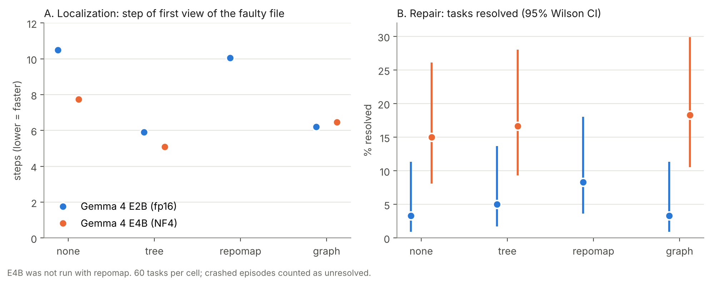

# RepoFix-Mini — Finding Is Not Fixing

Code, benchmark and episode logs for the paper
**"Finding Is Not Fixing: Repository Structure Speeds Localization but Not Repair in Gemma 4 Coding Agents"**
(Kaggle — Google Gemma 4 Developer Agent, Paper Track, 2026).

Author: Ali A. Al-Saffar, College of Administration and Economics, University of Mosul, Iraq
([ORCID 0009-0005-0918-893X](https://orcid.org/0009-0005-0918-893X)).

## Main result



Giving a Gemma 4 agent a structural digest of the repository makes it find the faulty file
much sooner, but it does not make it fix more bugs. Model scale does.

| Model | Condition | Step of first view of faulty file | Resolved |
|---|---|---|---|
| E2B (fp16) | none | 10.5 | 2/60 |
| E2B (fp16) | tree | 5.9 | 3/60 |
| E2B (fp16) | repomap | 10.1 | 5/60 |
| E2B (fp16) | graph | 6.2 | 2/60 |
| E4B (NF4) | none | 7.7 | 9/60 |
| E4B (NF4) | tree | 5.1 | 10/60 |
| E4B (NF4) | graph | 6.5 | 11/60 |

Full statistics (Wilcoxon, McNemar, Wilson CIs, sensitivity analysis) are in
`results/summary.csv` and are reproduced by `analysis/analyze.py`.

## Repository layout

| Path | Contents |
|---|---|
| `repofix.py` | Benchmark builder (AST mutation + test filtering), the four representations, the agent loop, evaluation and statistics |
| `notebooks/02_gemma4_repo_representation.ipynb` | Kaggle notebook that runs the experiment on 2× T4 (resumable) |
| `data/repofix_mini_tasks.jsonl` | The 60 tasks used (12 per repository): mutation, fail-to-pass and pass-to-pass tests, issue text |
| `results/episodes.jsonl` | All 420 episodes (one line per model × condition × task) |
| `results/summary.csv` | Per-cell statistics |
| `analysis/analyze.py`, `analysis/figure.py` | Reproduce every number and the figure |

## Reproduce the analysis (seconds, no GPU)

```bash
pip install numpy pandas scipy matplotlib
python analysis/analyze.py      # prints all tables, writes results/summary.csv
python analysis/figure.py       # writes results/figure1.png
```

## Re-run the experiment (Kaggle, 2× T4, two to three 12-hour sessions)

1. Create a Kaggle notebook from `notebooks/02_gemma4_repo_representation.ipynb`.
2. Add inputs: a dataset containing `data/repofix_mini_tasks.jsonl` renamed to
   `repofix_mini_v1.jsonl`, and the Gemma 4 models `gemma-4-e2b-it` and `gemma-4-e4b-it`
   (Transformers) from Kaggle Models.
3. Settings: Accelerator **GPU T4 ×2**, Internet **on** (the notebook clones the five pinned repositories).
4. Run with **Save & Run All (Commit)**. The run stops cleanly before Kaggle's 12-hour limit;
   attach its `results*.jsonl` outputs as an input and re-run to resume.

## Benchmark repositories

Tasks are built from pinned releases of
[toolz](https://github.com/pytoolz/toolz) 1.1.0,
[boltons](https://github.com/mahmoud/boltons) 26.2.0,
[click](https://github.com/pallets/click) 8.5.0,
[jinja](https://github.com/pallets/jinja) 3.1.6 (BSD-3-Clause) and
[marshmallow](https://github.com/marshmallow-code/marshmallow) 4.3.1 (MIT).
The task file contains short code fragments and test names from these projects, which remain under
their own licenses.

## License

Code and data in this repository: Apache-2.0 (see `LICENSE`).
